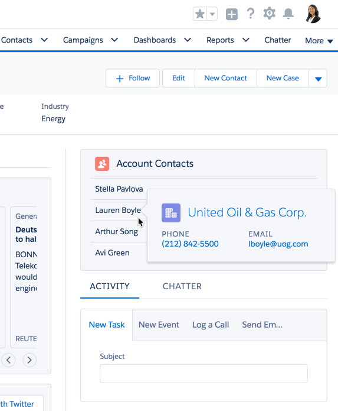

# PopoverExampleComponent

This is a Lightning Component that illustrates how to trigger a popover when the user hovers over a field in a list. The popover contains additional info from the contact's record. It can only be added to an Account Record Detail page.

